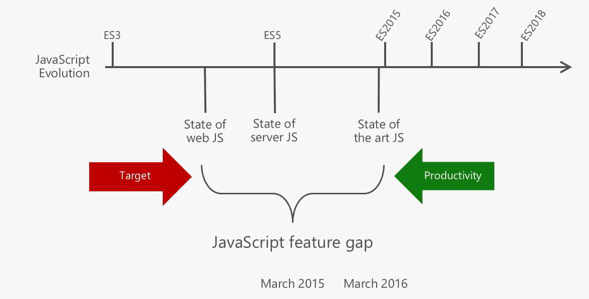
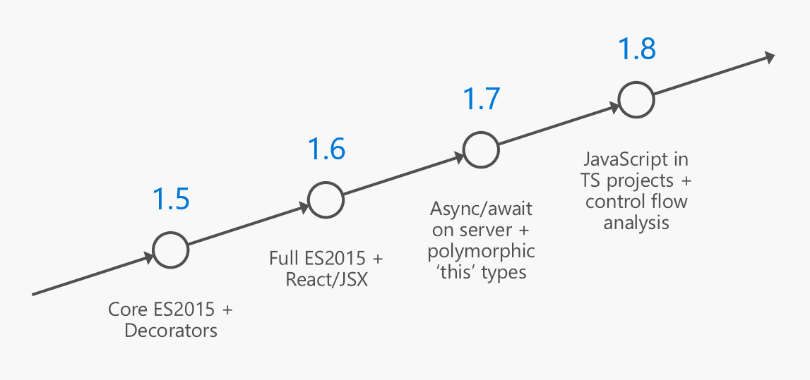
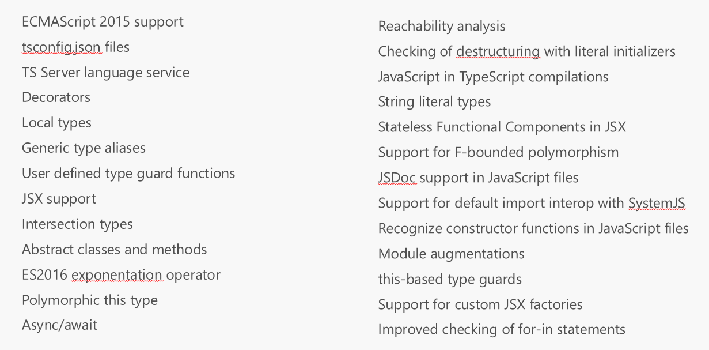
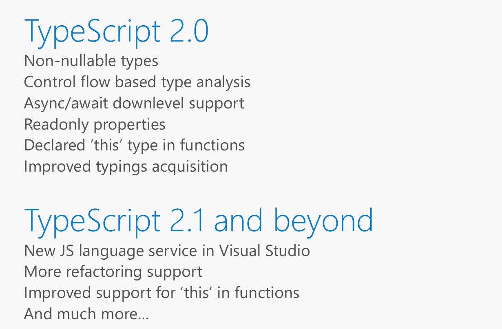

# TypeScript

TypeScript 是添加了静态类型的 JavaScript 超集，它会编译为 JavaScript 代码运行。

- Any browser. Any host. Any OS.
- Open Source
- 依托静态类型的强大 IDE 支持
- 提前使用新的语法特性

# TypeScript 基础 

- JS  to  TS
- Interface
- 类型推导
- Lambda 表达式 （箭头函数）
- 编译
- Class
- 重构 Rename
- 泛型

# TypeScript 路线图

